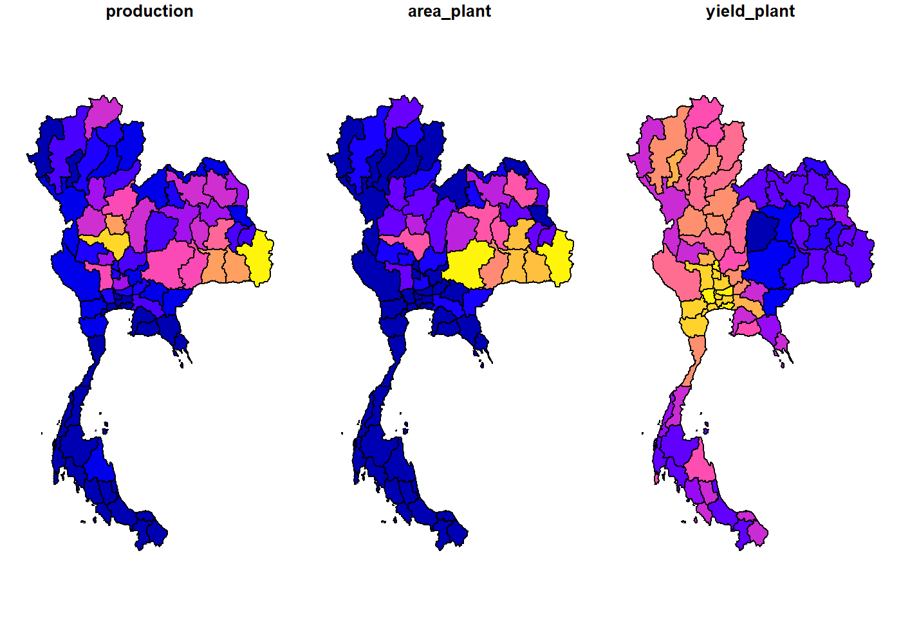

# mapthai

An R package storing ligtweight geospatial polygon data of Thailand
administrative level 1-3 including province (Changwat), district
(Amphoe) and subdistrict (Tambon) in geojson and rda (`sf` class)
format. Please see more details in [package
website](https://piyayut-ch.github.io/mapthai/)

**Notes:**  
- Thailand maps are downloaded from
[UNOCHA](https://data.humdata.org/dataset/thailand-administrative-boundaries)  
- Source: Royal Thai Survey Department update 6 November 2019  
- Maps are simplified using [mapshaper](https://mapshaper.org)  
\* Import Options : detect line intersections  
\* Simplification menu : check prevent shape removal  
\* Method : Visvalingam / effective area

